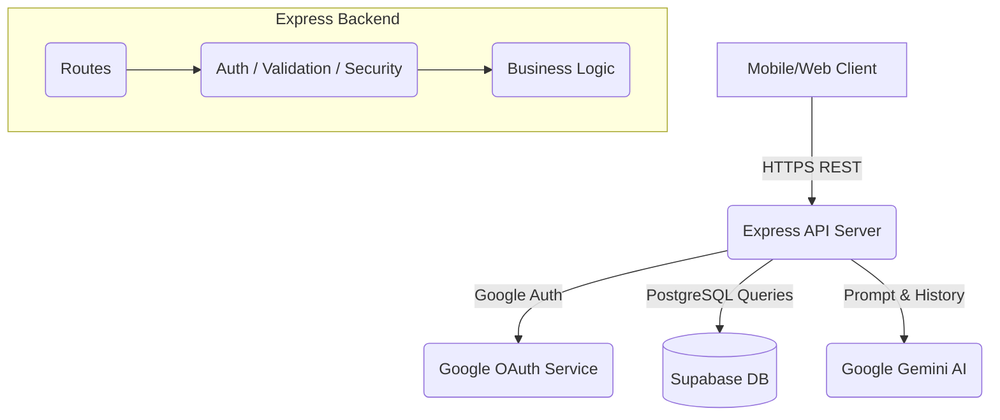
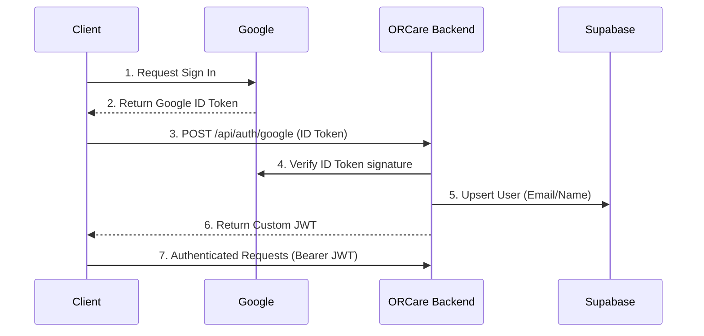

# ORCare Architecture

The ORCare backend is a monolithic Express.js API designed to securely serve a mobile frontend while leveraging cloud services for data persistence and AI capabilities.

## High-Level Architecture

## Authentication Flow

With the transition to Google Sign-In, the flow is as follows:

## Directory Structure

*   **`server.js`**: The entry point. Handles middleware initialization (Helmet, CORS, Rate Limit) and mounts routes.
*   **`routes/`**: Defines the URL endpoints and HTTP verbs, binding them to specific controller functions. Also applies `express-validator` rules.
*   **`controllers/`**: Contains the core business logic.
    *   `authController.js`: Google OAuth verification and custom JWT issuance.
    *   `userController.js`: Profile management and account deletion.
    *   `chatController.js`: Integrates with Gemini AI and persists chat history.
    *   `quizController.js` & `contentController.js`: Handle educational content and quiz tracking.
*   **`middleware/`**: 
    *   `authMiddleware.js`: Validates the custom JWTs before allowing access to protected routes.
*   **`config/`**:
    *   `db.js` & `supabase.js`: Initializes the Supabase PostgreSQL client connection.
