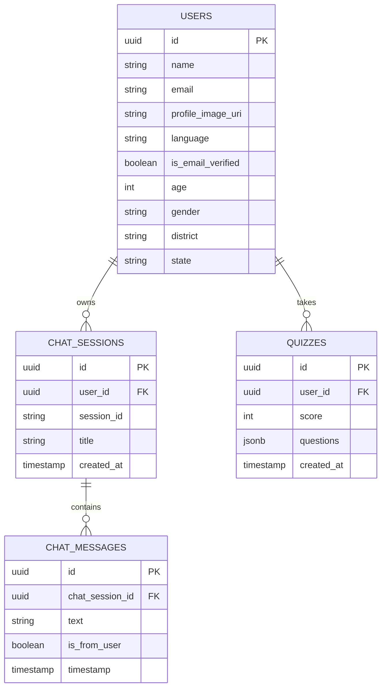

# Database Schema

ORCare utilizes Supabase (PostgreSQL) for all relational data storage.

## ER Diagram (Conceptual)

## Setup Notes
*   We bypass Supabase Row Level Security (RLS) policies by utilizing the `SUPABASE_SERVICE_ROLE_KEY` directly on the backend. 
*   The backend validates the JWT and handles authorization natively, meaning the PostgreSQL tables do not need complex RLS rules for this implementation.
